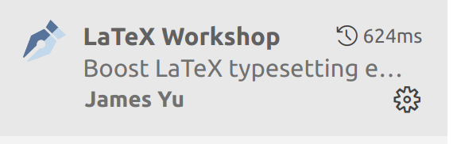
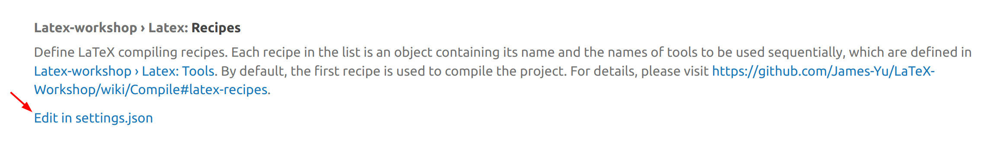
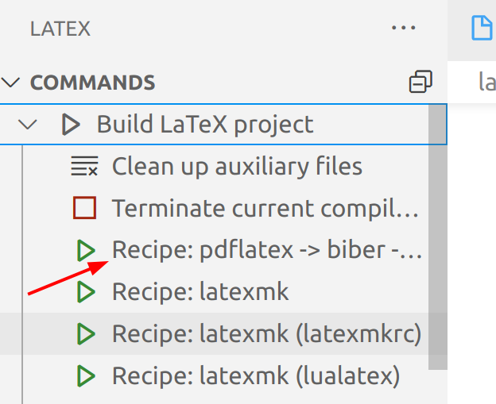
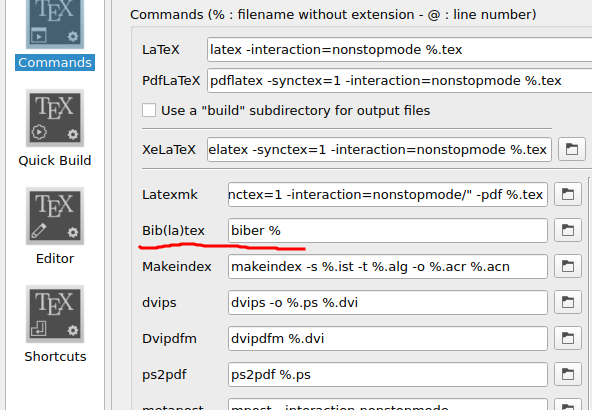
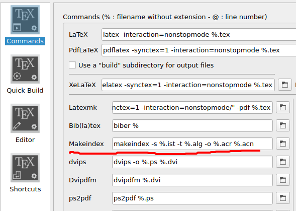
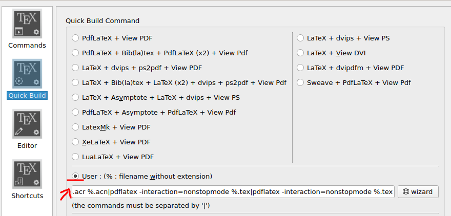
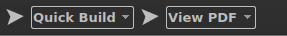

# Vorlage für Abschlussarbeiten mit LaTeX

Diese Vorlage ist für Abschlussarbeiten mit LaTeX an der Technischen Hochschule Mannheim gedacht. Sie erhebt keinen Anspruch darauf, den Wünschen aller Professorinnen und Professoren zu entsprechen. Klären Sie daher immer im Voraus mit Ihrer Betreuerin bzw. Ihrem Betreuer (und auch Zweitkorrektor), ob die Vorlage ihren bzw. seinen Vorstellungen entspricht.

**Der Titel auf der ersten Seite ist absichtlich nicht zentriert! Er ist so platziert, dass er bei dem [offiziellen Papierumschlag](https://www.tbl.hs-mannheim.de/fileadmin/user_upload/einrichtungen/tbl/1-Dokumente/Deckblatt_Einband_HS_Mannheim.pdf) der Hochschule korrekt in dem Fenster erscheint.** Wenn Sie die Arbeit rein digital abgeben, können Sie durch Setzen der entsprechenden Option in der Datei `thesis.tex` eine digitale Abgabe konfigurieren; dann ist auch der Titel zentriert.

Wenn Sie Probleme haben oder Fehler entdecken, öffnen Sie ein [Issue](https://github.com/informatik-mannheim/thesis-template/issues). Lesen Sie aber vorher diese Anleitung und die [Erklärungen in der Hauptdatei](https://github.com/informatik-mannheim/thesis-template/blob/master/latex/tex/thesis.tex#L1) bis zum Ende, denn vielleicht klärt sich Ihre Frage dann von selbst.

Verbesserungen können Sie jederzeit als GitHub Pull-Request an uns senden.

Diese Vorlage wurde entwickelt von [Prof. Thomas Smits](http://www.smits-net.de) und Prof. Dr. Jessica Steinberger.

Wenn Ihnen die Vorlage gefällt, können Sie diesem _Repo einen Stern geben_ - dann wissen wir, wer sie benutzt.

## Werkzeuge, Dateiformat

### Lokale Entwicklungsumgebungen

Zum Erzeugen der fertigen Arbeit dienen die Skripte `create` und `clean`. Die .cmd-Version ist für Windows, die .sh für Unix/Linux.

Zusätzlich liegt im Verzeichnis `/tex` noch ein Makefile mit dem man die Quellen mit Hilfe von `make` übersetzen kann. Der Vorteil hiervon ist, dass `make` erkennt, ob sich Inhalte geändert haben und nur dann die Arbeit neu übersetzt.

Sie können auch eine integrierte Entwicklungsumgebung verwenden. Hierbei haben sich folgende bewährt:

  * [TeXnicenter](http://www.texniccenter.org/) für Windows (siehe unten)
  * [Texmaker](http://www.xm1math.net/texmaker/) für Windows, MacOS und Linux

Ausserdem müssen sie LaTeX auf Ihrem Rechner installieren. Bei Linux erfolgt dies einfach über den Paketmanager der verwendeten Distribution, z.B. `sudo apt install texlive-full` für Ubuntu. Für Windows und MacOS empfehlen sich:

  * [MikTeX](http://miktex.org/) für Windows
  * [MacTeX](http://tug.org/mactex/) für MacOS

Für die Verwaltung der Literaturliste wird das BibTeX-Format verwendet (Datei `literatur.bib`). Obwohl Sie diese Datei auch von Hand bearbeiten können, empfiehlt es sich, hierfür ein Werkzeug einzusetzen. Bewährt haben sich:

  * [JabRef](http://jabref.sourceforge.net/) für Windows, MacOS und Linux
  * [BibDesk](http://bibdesk.sourceforge.net/) für MacOS

Achten Sie darauf, die Dokumente im UTF-8-Format abzulegen. Nur so ist eine plattformunabhängige Verwendung gewährleistet. Die Vorlagen hier sind ebenfalls im UTF-8-Format.

### Cloud-Dienste

Diese Vorlage wurde bereits von Studierenden erfolgreich bei Cloud-Diensten eingesetzt, mit denen man LaTeX-Dokumente schreiben, kompilieren und verwalten kann. Positive Erfahrungsberichte liegen bisher mit [Overleaf](https://www.overleaf.com) vor. Eine Anleitung zu Overleaf finden Sie weiter unten, ohne diese werden Sie vermutlich einen Compile-Fehler bekommen.

## Aufbau der Vorlage

Die Vorlage enthält eine Reihe von Dateien, die Sie teilweise nach Ihren Bedürfnissen anpassen müssen bzw. mit Ihren Inhalten füllen.

Anpassen müssen Sie die folgenden Dateien

  * `thesis.tex` - Hauptdokument. Hier müssen Sie weitere Kapitel aus dem Ordner `kapitel` inkludieren.
  * `docinfo.tex` - Bibliografische Informationen zur Arbeit, müssen Sie mit Ihren Daten füllen
  * `hma.cls` - Dokumentenklasse für die Abschlussarbeit
  * `kapitel/abkuerzungen.tex` - Liste der in der Arbeit verwendeten Abkürzungen
  * `kapitel/glossar.tex` - Einträge für ein Glossar
  * `kapitel/symbole.tex` - Einträge für ein Symbol und Einheitenverzeichnis
  * `kapitel/kapitel1.tex` - Beispiel für ein Kapitel
  * `kapitel/kapitel2.tex` - Weiteres Beispiel für ein Kapitel
  * `kapitel/kapitel3.tex` - Weiteres Beispiel für ein Kapitel
  * `kapitel/kapitel4.tex` - Weiteres Beispiel für ein Kapitel
  * `kapitel/anhang-a.tex` - Beispiel für einen Anhang
  * `kapitel/anhang-b.tex` - Beispiel für einen Anhang
  * `literatur.bib` - Literaturdatenbank im BibTeX-Format
  * `bilder/unterschrift.png` - Gescannte Unterschrift für die digitale Abgabe

Weitere Kapitel können hinzugefügt werden und dann vom Hauptdokument `thesis.tex` inkludiert.

Normalerweise nicht verändern müssen Sie

  * `preambel.tex` - Einstellungen zum Dokument.
  * `studiengaenge.tex` - Bezeichungen der Studiengänge, Fakultäten und Abschlüsse
  * `hma.cls` - Dokumentenklasse für die Abschlussarbeit

Die Vorlage ist für doppelseitigen Druck optimiert. Wenn Sie die Arbeit einseitig ausdrucken, sieht das Ergebnis seltsam aus, weil es unnötig viele leere Seiten enthält und die Seitenzahlen zwischen rechtem und linkem Rand springen. Für **einseitigen Druck** müssen sie die Datei `preambel.tex` ändern und `twoside=on` in `twoside=off` ändern.

Es gibt drei Ordner

  * `/kapitel` - Ablageort für die einzelnen Kapitel
  * `/bilder` - Ablageort für die verwendeten Bilder
  * `/src` - Ablageort für die verwendeten Quelltexte von Programmen, die in der Arbeit gezeigt werden sollen.
  * `/pdfs` - Ablageort für die einzubindende PDF Dokumente

Die Datei `thesis-overleaf.zip` dient dem einfachen Import in [Overleaf](https://www.overleaf.com) - siehe nächstes Kapitel.

## LaTeX-Projekt mit VSCode benutzen

Wenn Sie dieses Projekt in [Visual Studio Code](https://code.visualstudio.com/) zusammen mit [LaTeX-Workshop](https://marketplace.visualstudio.com/items?itemName=James-Yu.latex-workshop) einsetzen wollen, müssen Sie ein paar Einstellungen machen. Fehlen diese, wird das Abkürzungsverzeichnis nicht korrekt gebaut.

### Einstellungen anpassen

  1. Installieren Sie LaTeX-Workshop
  2. Öffnen Sie die Liste der Erweiterungen 
  3. Suchen Sie nach "LaTex-Workshop" und klicken Sie auf das Zahnrad<br>
  4. Wählen Sie in dem Menue "Extension Settings"
  5. Scrollen Sie runter bis zum Eintrag "LaTeX: Recepies" und klicken Sie auf "Edit settings.json"<br>
  6. Fügen Sie hinter `"latex-workshop.latex.recipes": [` ein neues Rezept ein:

```json
{
  "name": "pdflatex -> biber -> makegloassaries -> pdflatex * 2",
  "tools": [
      "pdflatex",
      "biber",
      "makeglossaries",
      "pdflatex",
      "pdflatex"
  ],
},
```

Vor der letzten schließenden Klammer fügen Sie noch folgendes ein:

```json
"latex-workshop.latex.tools":[
        {
            "name": "pdflatex",
            "command": "pdflatex",
            "args": [
                "-synctex=1",
                "-interaction=nonstopmode",
                "-file-line-error",
                "%DOC%"
            ]
        },
        {
            "name": "makeglossaries",
            "command": "makeglossaries",
            "args": [
              "%DOCFILE%"
            ]
          },
        {
            "name": "biber",
            "command": "biber",
            "args": [
                "%DOCFILE%"
            ]
        }
    ]
  ```

Den vollständigen Abschnitt der Datei finden Sie hier: [settings.json](images/settings.json).

### Preambel anpassen

Damit VSCode die thesis.tex als Hauptdatei erkennt, müssen Sie folgende Zeile an den Anfang in `preambel.tex` und `thesis.tex` einfügen:

```
% !TEX root = ./thesis.tex
```

### Änderungen testen

  1. Schließen Sie VSCode und öffnen Sie es neu.
  2. Öffnen Sie das LaTeX-Dokument und klicken Sie auf das Icon von LaTeX-Workshop 
  3. Wenn Sie den Punkt "Build LaTeX projekt" aufklappen, sollte ein neuer Menueeintrag vorhanden sein.<br>
  4. Durch Klicken auf diesen Punkt können Sie die Arbeit vollständig und korrekt bauen. Da er der erste Punkt ist, sollte er auch standardmäßig bei Änderungen am Projekt ausgeführt werden.


## LaTeX-Projekt unter Overleaf einrichten

 * Laden Sie die ZIP-Version des Projektes [hier](https://github.com/informatik-mannheim/thesis-template/raw/master/latex/thesis-overleaf.zip) herunter.
 * Melden Sie sich bei [Overleaf](https://www.overleaf.com) an und loggen Sie sich ein.
 * Gehen Sie auf "New Project" und wählen Sie "Upload Project"
 * Laden Sie die ZIP-Datei hoch.
 * Sie werden jetzt Compile-Fehler bekommen, aber keine Panik, dies liegt daran, dass Overleaf nicht weiß, welches das Hauptdokument ist
 * Wählen Sie das Overleaf Logo oben links, um das Einstellungsmenue aufzurufen und stellen Sie die Option "Main document" auf `thesis.tex`
 * Wählen Sie nun in der Dateiliste ebenfalls `thesis.tex`
 * Drücken Sie auf "Recompile" - das Projekt sollte jetzt bauen

Overleaf Premium ermöglicht es mit den Funktionen ["Git-Bridge" und "GitHub Synchronization"](https://de.overleaf.com/learn/how-to/Using_Git_and_GitHub) Änderungen mit einem lokalen Repository oder einem Repository auf GitHub zu synchronisieren. Es ist aus technischen Gründen sinnvoll, das Overleaf-Projekt in einem eigenen Repository zu verwalten, das dann als [*Git Submodul*](https://git-scm.com/book/de/v2/Git-Tools-Submodule) zu einem anderen Repository hinzugefügt werden kann, welches zum Beispiel den Quellcode der Arbeit enthält.

## LaTeX-Projekt unter Texmaker einrichten

[Texmaker](https://www.xm1math.net/texmaker/) unterstützt alle Betriebssysteme.

  * Öffnen Sie die Datei `thesis.tex` mit Texmaker
  * Gehen Sie auf "Options" -> "Define current document as 'Master Document'"
  * Gehen Sie auf "Options" -> "Configure Texmaker"
    * Tragen Sie unter "Commands" -> "Bib(la)tex" als Kommando `biber %` ein<br>
    * Tragen Sie unter "Commands" -> "Makeindex" als Kommando `makeindex -s %.ist -t %.alg -o %.acr %.acn` ein<br>
    * Wählen Sie unter "Quick Build" die Option "User"<br><br>Und tragen Sie den folgenden String dort ein:<br>`pdflatex -interaction=nonstopmode %.tex|biber %|makeindex -s %.ist -t %.alg -o %.acr %.acn|pdflatex -interaction=nonstopmode %.tex|pdflatex -interaction=nonstopmode %.tex`
  * Wählen Sie in der Menuezeile "Quick Build" aus<br>
  * Klicken Sie auf den Pfeil links von "Quick Build"
  * Um die aktuelle Version des Dokuments anzuzeigen, klicken Sie auf den Pfeil links von "View PDF".

## LaTeX-Projekt unter TeXnicCenter einrichten

Ab der Version 2 von TeXnicCenter wird das UTF-8-Format richtig unterstützt.

  * Öffnen Sie die Datei `thesis.tex` mit TeXnicCenter
  * Wählen Sie in Projekt "Erzeugen mit aktueller Datei als Hauptdatei"
    * "verwendet BibTex" ankreuzen
    * "verwendet Makeindex" ankreuzen
    * Sprachinformation für die Rechtschreibkorrektur setzen
  * Unter "Ausgabe" den Punkt "Ausgabeprofil definieren" wählen
    * LaTeX => PDF auswählen
    * "Pfade des BibTeX-Compilers" von `...\bibtex.exe` auf `...\biber.exe` ändern
  * Unter "Ausgabe" den Punkt "Aktive Ausgabeprofil wählen" anklicken
    * LaTeX => PDF auswählen

Damit alle Referenzen und Literaturangaben im Dokument korrekt sind, müssen Sie es bis zu drei Mal erzeugen.
